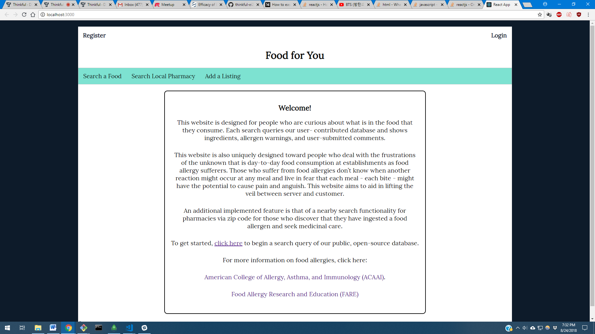
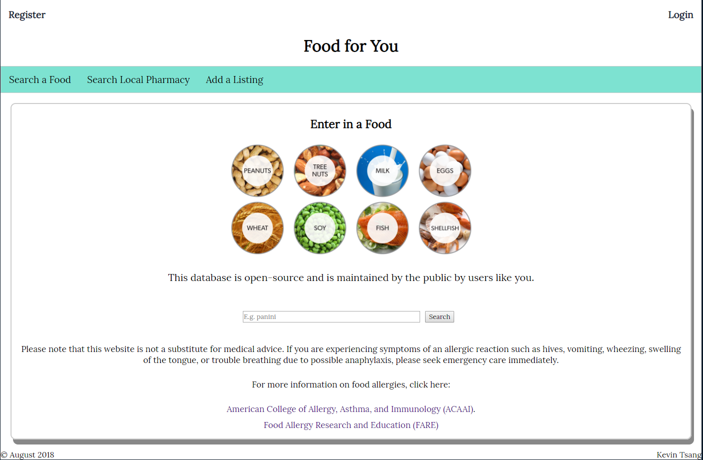
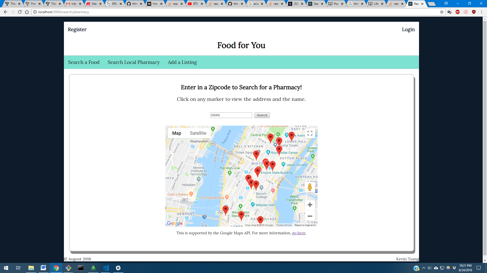
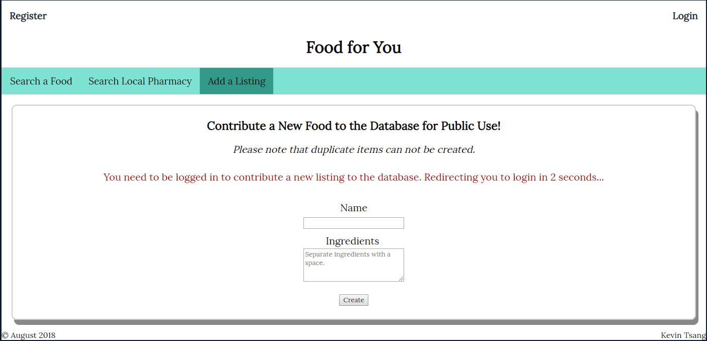
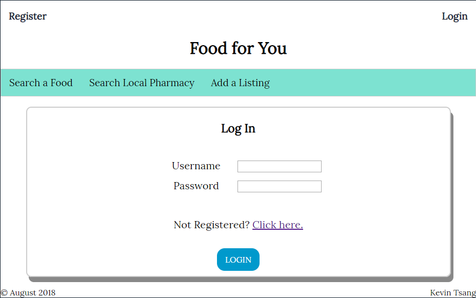
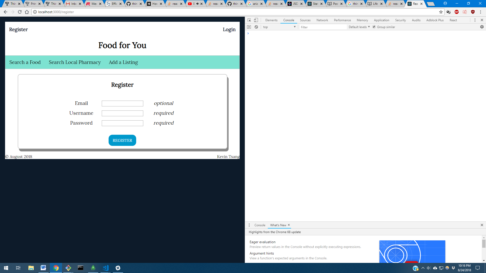

## Full Stack Capstone -- Allergen Search Website

Users can query the open-source database and search a food item. Upon clicking on the listing,ingredients will be shown and a warning will be shown that contains possible allergens in that food item.

Users can also post comments in each listing to add information like other possible allergens that could comtaminate the food item.

Users can enter in a zipcode to search for nearby pharmacies if they find a possible allergen in the food item that they search that they are allergic to. Markers will be rendered and it will show an information window that shows the address and name of the marker.

Users can also sign up to post a new listing to the database by registering. Posting to the database is a protected endpoint as is updating and deleting, which have yet to be implemented but is seen to be used by admins in the future. 

Deployed Website: https://intense-journey-81653.herokuapp.com/

This is the Landing Page where all the users initially see. A short description about the website is about and its intentions are stated. 

This is the main tab where all the queries are done. Here, you can query a food from the mock database, expand each item, and add comments. 

This tab is specifically designed for those who are food allergy sufferers in the event that someone discovers that they have ingested a food item with an ingredient they are allergic to. A zip code search will bring up nearby markers with address and name.

This tab is login protected because I wanted the database to be somewhat secure. I did not want just anyone to be able to contribute such that the database could be easily tampered with by nefarious parties.

These two images show the register and login screens where-in you can sign up and contribute to the database.

React and Redux are used on the front-end (with Create React-App and Buildpack for Heroku).
NodeJS and as well as Mongoose and Express are used on the back-end with MongoDB as the database storage. 

NPM Modules used are:

  * Front-end
    1. Compose
    2. Dotenv
    3. Enzyme
    4. Jwt-decode
    5. React
    6. React-dom
    7. React-Google-Maps
    8. React-router-dom
    9. React-Redux
    10. Redux
    11. Redux-Logger
    12. Redux-thunk
    13. Zipcodes
    
  * Back-end
    1. Bcryptjs
    2. Cors
    3. Dotenv
    4. Email-validator
    5. Express
    6. Passport
    7. Passport-jwt
    8. Passport-local
    9. Mongoose
    10. Morgan
    11. Request

The Google Maps API call is being buffered through to my backend because Google does not allow native front-end calling without their Vanilla API. Every time my search is being called, it updates the redux state. Every time I click to expand, a React state is set. Every time I expand a listing as well, it updates the listing immediately via a call to my back-end to do two database calls, one after another, to compare the ingredients to a seeded allergen collection. When I post a comment, it also updates it on the backend where it attempts to re-render on the front-end. 

This project was bootstrapped with [Create React App](https://github.com/facebookincubator/create-react-app).
